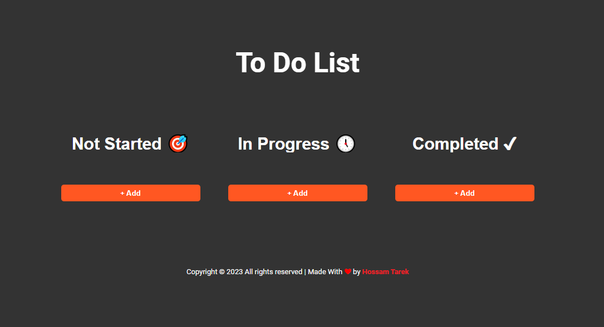
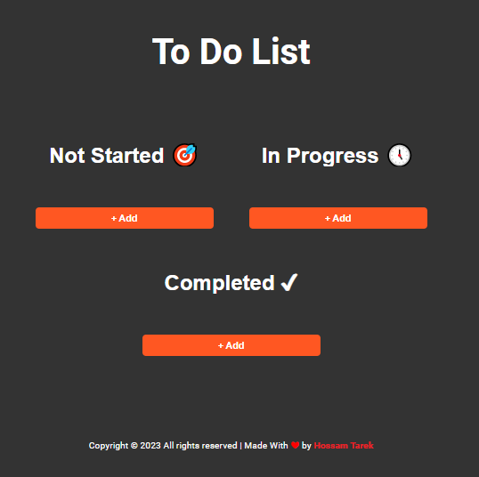
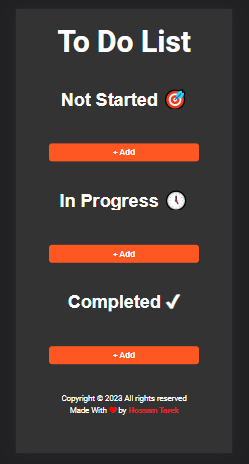

# Kanban Board Project

### What is Kanban Board ?

> A kanban board is an agile project management tool designed to help visualize work, limit work-in-progress, and maximize efficiency (or flow).

### [🔗 Live Demo link](https://github.com/hossam4444)

## Technologies I used :

- **[ HTML , CSS , Flex-Box , Vanilla JavaScript, ES6 , Touch & Darg Events ]**

## Features :

1. **You can Add tasks.**
1. **You can Edit tasks.**
1. **You can Delete tasks.**
1. **You can Drag and drop tasks.**
1. **You can Save your project in Browser local Storage.**
1. **You can Delete All Tasks by one click.**
1. **It's totally responsive website.**

## What I'm looking for the next Update ?

- **Add the ability to arrange tasks by specific order .**
- **Convert it to Single Page Application with React .**
- **Update the UI & UX 🎨.**

## What did I learn from this project?

> I learned a lot actually but the most important that I challenged myself and I learned a lot of amazing stuff like:

- **Programmatic logic exercises.**
- **I Learned a lot about Touch events**
- **I Learned a lot about HTML Drag & Drop API.**
- **I Learned a lot about LocalStorage.**

## Some usefully resources helped me to build this project.

- [MDN HTML Drag and Drop](https://developer.mozilla.org/en-US/docs/Web/API/HTML_Drag_and_Drop_API)
- [MDN Touch Events](https://developer.mozilla.org/en-US/docs/Web/API/Touch_events)
- [JavaScript Drag & Drop Sortable List Project by Traversy Media](https://www.youtube.com/watch?v=wv7pvH1O5Ho&t=360s)
- [Learn JavaScript Touch Events In 17 Minutes](https://www.youtube.com/watch?v=TaPdgj8mucI)
- [Maximilian Schwarzmüller JAVASCRIPT Course (main course)](https://www.udemy.com/course/javascript-the-complete-guide-2020-beginner-advanced/)

> The Most Of inspiration From Ahmed M. Ezzeldeen [his LinkedIn Profile](https://www.linkedin.com/in/ahmed3zzeldeen/)
